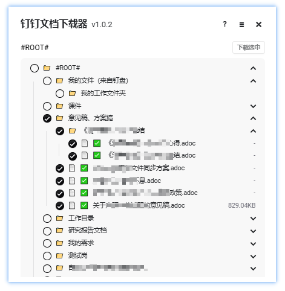

# DingDocDownloader

这是一个钉钉文档下载工具，先在浏览器打开钉钉文档的站点，再运行本工具。

[开始使用](https://test.microanswer.cn/dingdocdownloader/)

## 预览

## 使用方法

打开工具后，勾选你想下载的文档或目录，然后点击【下载选中】，会让你选择一个目录来保存
你勾选的文件，选择后将会开始下载，下载完成的目录结构和钉钉文档里的目录结构相同。
